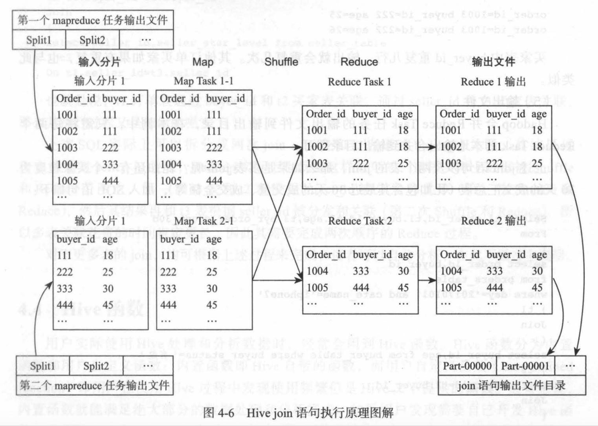
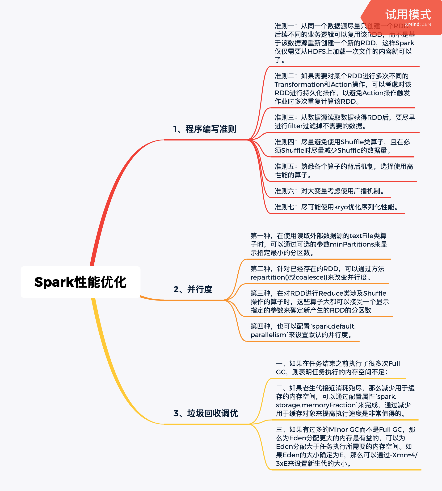

# 学习笔记(总结)

## 1、Java基础

### 1.1 Java基本数据类型有哪些？(有问题)
Java的基本数据类型有八种，具体如下：
1. 四种整数类型：byte、short、int、long
2. 两种浮点数类型：float、double
3. 一种字符类型：char
4. 一种布尔类型：boolean

### 1.2 ArrayList与LinkedList的区别？(有问题)
1. ArrayList是基于动态数组的数据结构，LinkedList是基于链表的数据结构。
2. 对于随机访问get和set，ArrayList要优于LinkedList，因为LinkedList要移动指针。
3. 对于新增和删除操作，LinkedList要优于ArrayList，因为ArrayList要移动数据。

### 1.3 HashMap、HashTable、ConcurrentHashMap各自的技术原理和使用场景是什么？(有问题)
- HashMap：实现了Map接口，将唯一键映射到特定值上，允许一个NULL键和多个NULL值，非线程安全。
- HashTable：类似于HashMap，但是不允许NULL键和NULL值，比HashMap慢，因为他是同步的。HashTable是一个线程安全的类，它使用Synchronized来锁住整张Hash表来实现线程安全。
- ConcurrentHashMap：允许多个修改操作并发进行，其关键在于使用了锁分离技术，通过使用多个锁来控制对Hash表的不同部分进行的修改，其内部使用段来表示这些不同的部分，每个段其实就是一个小的HashTable，他们有自己的锁，只要修改操作发生在不同的段上，他们就可以并发进行。

### 1.4 HashMap和HashTable的区别

1. **线程安全性**：HashMap是线程不安全的，HashTable是线程安全的，通过使用Synchronized来锁住整张Hash表来实现线程安全。
2. **是否提供contains方法**：HashMap只有containsKey和containsKey方法；HashTable有contains、containsKey和containsValue三个方法，其中contains和containsValue方法功能相同。
3. **key和value是否允许null值**：HashMap中null可以作为键，这样的键只有一个，但是可以有一个或多个键所对应的值为null；HashTable中，key和value都不允许出现null值。
4. **数据初始化和扩容机制**：HashMap的默认容量为16，而HashTable的默认容量为11；HashMap要求底层数组的容量一定要为2的整数次幂，而HashTable不要求底层数组的容量一定要为2的整数次幂；HashMap扩容时，容量变为原来的2倍，而HashTable扩容时，将容量变为原来的2倍加1.

## 2、Java多线程

### 2.1 Runnable和 Thread的区别？(有问题)
Runnable和Thread本身并没有实质的区别，除此之外，主要有以下区别：
1. Runnable的使用方式是实现其接口，Thread的使用方式是继承其类，二者都需要实现run方法。
2. Runnable接口支持多继承，但基本上用不到。
3. Thread实现了Runnable接口并进行了扩展，而Thread和Runnable的市值是实现的关系，不是同类的东西，所以Runnable和Thread本身并没有可比性。

### 2.2 Thread类中的start()和run()方法有什么区别？(有问题)
- 通过start()方法来启动一个线程，此时线程处于就绪状态，可以被JVM来调度执行，在调度过程中，JVM通过调用线程类的run()方法来完成实际的业务逻辑，当run()方法结束后，此线程就会终止，所以通过start()方法可以达到多线程的目的。
- 如果直接调用线程类的run()方法，会被当做一个普通的函数调用，程序中仍然只有主线程这一个线程，即start()方法呢能够异步的调用run()方法，但是直接调用run()方法确实同步的，无法达到多线程的目的。

### 2.3 Java多线程中调用wait()和sleep()方法有什么不同？(有问题)
相同点：
1. 他们都是在多线程的环境下，都可以在程序的调用出阻塞指定的毫秒数，并返回。
2. 二者都可以通过interrupt()方法打断现成的暂停状态，从而使线程立刻抛出InterruptedException。
不同点：
1. wait()属于Object类的方法，sleep()属于Thread类的方法。
2. 每个对象都有一个锁来控制同步访问，Synchronized关键字可以和对象的锁交互，来实现现成的同步。sleep()方法没有释放锁，而wait()方法释放了锁，使得其他线程可以使用同步控制块或者方法。
3. wait()方法只能在同步控制方法或者同步控制块里面使用，而sleep()可以在任何地方使用。
4. sleep()方法必须捕获异常，而wait()方法不需要捕获异常。

### 2.4 ReentrantLock和Synchronized的区别？(有问题)
相同点：
两者都是可重入锁，他们的加锁方式都是同步，而且都是阻塞式的同步，也就是说当一个线程获得了对象锁，进入了同步块，其它访问概统不快的线程都必须阻塞在同步块外面等待。
不同点：
1. 原始构成：Synchronized是Java语言的关键字，是原生层面的互斥，需要jvm实现；而ReentrantLock是JDK1.5之后提供的API层面的互斥锁类。
2. 实现：Synchronized是通过JVM来加锁和解锁；ReentrantLock是API层面的加锁和解锁。
3. 代码编写：Synchronied不需要用户去手动释放锁，当Synchronied方法或者代码块执行完之后，系统会自动让线程释放对锁的占用，更安全；而ReentrantLock则必须要用户去手动释放锁，如果没有主动释放锁，就有可能导致死锁现象。
4. 等待可中断：Sychronied不可中断，直到代码执行完，才正常释放锁，除非抛出异常，由JVM退出等待；ReentrantLock在持有锁的线程长期不释放的时候，正在等待的线程可以选择放弃等待，可以通过tryLock来设置超时时间，时间过了之后就放弃等待，同时可以将lockInterruptibly()方代码块中，调用interrupt()方法来中断，但是Synchronied不行。

### 2.5 volatile适用于高并发的什么场景？(有问题)
volidate最适合一个线程写，多个线程读的场景，如果有多个线程并发写操作，仍然需要使用锁或者线程安全的容器或者原子变量来替代。我们只能在有限的一些场景下使用volidate变量来替代锁，要使volidate变量提供理想的线程安全，必须同时满足下面两个条件：
1. 对变量的写操作不依赖于当前值。
2. 该变量没有包含在具有其他变量的不变式中。


### 2.6 多线程join方法用于什么场景？(有问题)
主线程创建并启动了子线程，如果子线程中需要进行大量的耗时运算，主线程往往将早于子线程结束之前结束。如果主线程想等待子线程执行完毕后，获得子线程中的处理完的某个数据，就要用到join方法。join方法的作用是等待线程对象被销毁。

### 2.7 多个线程间如何共享数据？(有问题)
1. 如果每个线程执行的代码相同，可以使用同一个Runnable对象，这个Runnable对象中有那个共享数据。
2. 将共享数据封装成另一个对象，然后将这个对象逐一传递给各个Runnable对象，每个线程对共享数据的操作方法也分配到那个对象身上，这样容易实现针对数据进行各个操作的互斥和通信。
3. 将Runnable对象作为一个类的内部类，共享数据作为这个类的成员变量，每个线程对共享数据的操作方法页封装在外部类，以便实现对数据的各个操作的同步和互斥，作为内部类的各个Runnable对象调用外部类的这些方法。

### 2.8 线程的状态有哪些，各自的使用场景是什么？(有问题)
1. 新状态：线程被创建出来，但是还没有调用start()方法。
2. 可运行状态：线程有资格运行，但调度程序还没有把它选定为运行线程时所处的状态，此时正在等待操作系统分配资源、等待IO；连接，当satrt()方法调用时，线程首先进入可运行状态，在线程运行之后或者从阻塞、等待、睡眠状态回来后，也返回到可运行状态。
3. Running(运行状态)：线程调度程序从可运行池中选择一个线程作为当前线程时线程所处的状态。
4. 等待/阻塞/睡眠状态：这是线程有资格运行时它所处的状态，实际上这三个状态组合为一种，其共同点是线程仍旧是获得，但是当前没有条件运行，等待某件事件出现时，他可能返回到可运行状态。
5. 死亡状态：线程的run()方法完成时所处的状态。

### 2.9 Java自带哪几种线程池

1. **newCachedThreadPool**：创建一个可缓存线程池，如果线程池长度超过处理需要，可灵活回收空闲线程，若无可回收，则新建线程。如果长时间没有往线程池中提交任务，则该工作线程将自动终止。终止后，如果又提交了新的任务，则线程池重新创建一个工作线程。因此，在使用CachedThreadPool时，一定要注意控制任务的数量，否则，由于大量线程同时运行，很有可能会造成系统瘫痪。
2. **newFixedThreadPool(典型且优秀的线程池)**：创建一个指定工作线程数量的线程池。每当提交一个任务时就创建一个工作线程，如果工作线程数量达到线程池初始的最大数，则将提交的任务存入到池队列中。它具有提高程序效率和节省创建线程时所耗开销的优点。但是，在线程池空闲时，他不会释放工作线程，还会占用一定的系统资源。
3. **newSingleThreadExecutor**：创建一个单线程化的Executor，即只创建唯一的工作线程来执行任务，他只会用唯一的工作线程来执行任务，保证所有任务按照指定顺序执行。如果这个线程异常结束，会有另一个取代他，保证顺序执行，单工作线程最大的特点是可保证顺序地执行各个任务，并且在任意给定的时间不会有多个线程是活动的。
4. **newScheduleThreadPool**：创建一个定长的线程池，而且支持定时的以及周期性的任务执行。

## 3、JVM

### 3.1 运行时数据区域

JVM运行时数据区域主要有`程序计数器`、`虚拟机栈`、`本地方法栈`、`堆`、`方法区`五个区域。

> 注：如无特殊说明，本文所有图的来源为《深入理解Java虚拟机JVM高级特性与最佳实践》


- **程序让数器**
  - 程序让数器( Program Counter Register)是一块较小的内存空间,它可以看作是当前线程所执行的字节码的行号指示器。字解码解释器工作时就是通过改变这个计数器的值来选取下一条需要执行的字节码指令。
  - 每条线程都有一个独立的程序计数器，线程私有。
- **虚拟机栈**
  - 线程私有，生命周期与线程相同，描述的是Java方法执行的内存模型，每个方法在执行的时候会创建一个栈帧，方法从调用到执行完成的过程，就对应着一个栈帧在虚拟机栈中从入栈到出栈的过程。
- **本地方法栈**
  - 线程私有，与虚拟机方法栈的区别是虚拟机栈为虚拟机执行Java方法服务，而本地方法栈为虚拟机使用到的Native方法服务。
- **堆**
  - 线程共享，主要用于存放对象实例，是垃圾收集器管理的主要区域，主要分为新生代和老年代。
- **方法区**
  - 线程共享，主要用于存储已被虚拟机加载的类信息、常量、静态变量、即时编译器编译后的代码等数据。

### 3.2 判断对象是否存活的方法

判断对象是否存活的方法有两种，分别是`引用计数法`、`可达性分析算法`。

>注：如无特殊说明，本文所有图的来源为《深入理解Java虚拟机JVM高级特性与最佳实践》

- **引用计数法**
  - 引用计数法是指给对象添加一个引用计数器，每当有一个地方引用它时，计数器值就加1，当引用失效时，计数器值就减1，任何时刻计数器为0的对象就是不可能再被使用的。	
  - 缺点是它很难解决对象之间相互循环引用的问题。举个简单的例子，对象objA和obB都有字段Instance,赋值令 obja instance=objB及obiB. Instance=ojA，除此之外，这两个对象再无任何引用,实际上这两个对象已经不可能再被访问,但是它们因为互相引用着对方，导致它们的引用计数都不为0，于是引用计数算法无法通知GC收集器回收它们。


- **可达性分析算法**
  - 主要通过一系列的称为“GC Roots”的对象作为起点，从这些节点开始向下搜索，搜索所走过的路径称为引用链，当一个对象到GC Roots没有任何引用链相连（即从GC Roots到这个对象不可达）时，则证明对象是不可用的。


### 3.3 垃圾收集算法

#### 3.3.1 标记-清除算法

最基础的收集算法是“标记-清除”算法，算法分为“标记”和“清除”两个阶段：首先需要标记出所有需要回收的对象，在标记完成后统一回收所有被标记的对象。它的主要不足有两个：一个是效率问题，标记和清除两个过程的效率都不高；另一个是空间问题，标记清除之后会产生大量不连续的内存碎片，空间碎片太多可能会导致以后在程序运行过程中需要分配较大对象时，无法找到足够的连续内存而不得不提前触发另一次垃圾收集动作。

#### 3.3.2 复制算法

为了解决效率问题，一种称为“复制”的收集算法出现了，它将可用内存按容量划分为大小相等的两块，每次只使用其中的一块。当这一块的内存用完了，就将还存活着的对象复制到另外一块上面，然后再把已使用过的内存空间一次清理掉。这样使得每次都是对整个半区进行内存回收，内存分配时也就不用考虑内存碎片等复杂情况，只要移动堆顶指针，按顺序分配内存即可，实现简单，运行高效，只是这种算法的代价是将内存缩小为了原来的一半。

复制算法一般用来回收新生代，由于新生代中的对象是“朝生夕死”的，所以并不需要按照1:1的比例来划分内存空间，而是将内存划分为一块较大的Eden空间和两块较小的Survivor空间，每次使用Eden和其中一块Survivor。当回收时，将Eden和Survivor中还存活着的对象一次性复制到另一块Survivor空间上，最后清理掉Eden和刚才用过的Survivor空间。当Survivor空间不够用时，需要依赖其他内存进行分配担保。

#### 3.3.3 标记-整理算法

复制收集算法在对象存活率较高时就要进行较多的赋值操作，效率就会变低，更关键的是，如果不想浪费50%的空间，就需要额外的空间进行分配担保，以应对被使用的内存中所有对象都100%存活的极端情况，所以在老年代一般不能直接选用这种算法。

根据老年代的特点，有人提出了“标记-整理”算法，标记过程仍然与“标记-清除”算法一样，但后续步骤不是直接对可回收对象进行清理，而是让所有存活的对象都向一端移动，然后直接清理掉端边界以外的内存。

#### 3.3.4 分代收集算法

当代商业虚拟机的垃圾收集都采用“分代收集”算法，这种算法根据对象存活周期的不同将内存划分为几块。一般是把Java堆划分为新生代和老年代，这样就可以根据各个年代的特点选用最适当的收集算法：

- 在新生代中，每次垃圾回收都发现有大批对象死去，只有少量存活，那就选用复制算法，只需要付出少量存活对象的复制成本就可以完成收集。
- 在老年代中，因为对象存活率高，没有额外空间对它进行分配担保，就必须使用“标记-清理”或“标记-整理”算法来进行回收。

## 4、大数据

### 4.1 Hadoop

#### 4.1.1 HDFS读写流程

- 读取流程：
  1. 客户端发送打开文件指令给分布式文件系统。
  2. 分布式文件系统访问namenode，获取这个文件的数据块位置列表，返回输入流对象。
  3. 客户端从输入流中读取数据。
  4. 输入流从各个datanode读取数据。
  5. 关闭输入流。

- 写入流程：
  1. 客户端发送创建文件指令给分布式文件系统。
  2. 分布式文件系统告知namenode，namenode首先检查权限，查看文件是否存在，然后通过fsimage创建文件，此时没有数据块，然后通过EditLog增加记录，最后返回输出流对象。
  3. 客户端往输出流中写入数据，分成一个个数据包。
  4. 根据namenode分配，输出流往datanode写数据
  5. 每个datanode写完一个块后，返回确认信息。
  6. 写完数据，关闭输出流。
  7. 发送完成信号给namenode。

### 4.2 MapReduce

#### 4.2.1 MapReduce执行原理

MapReduce执行任务一般包括输入分片、Map、Shuffle、Reduce等阶段，其执行原理如下图所示：

> 图片来源于《离线和实时大数据开发实战》


- 输入分片：在进行Map计算之前，MapReduce会根据输入文件计算输入分片，每个输入分片对应一个Map任务。
- Map阶段：在Map阶段，各个Map任务会接收到所分配的分片，并调用Map函数，逐行执行并输出键值对。
- Combiner阶段：Combiner阶段是可选的，其实质也是一种Reduce操作，但它是一个本地化的Reduce操作，主要是在Map计算出的中间文件做一个简单的合并重复键值的操作，可以减少后续的处理和网络传输，但是使用它的原则是Combiner的输出不会影响到Reduce计算的最终输入，例如，如果计算只是求总数、最大值及最小值，可以使用Combiner操作，但是如果做平均值计算使用Combiner，最终的Reduce计算结果就会出错。
- Shuffle阶段：
  - Map Shuffle：对Map的结果进行分区(partition)、排序(sort)、分割(spill)，然后将属于同一分区的输出归并(merge)到一起并写在磁盘上，然后将不同的分区发送给对应的Reduce。
  - Reduce Shuffle：将各个Map输出的同一分区的输出进行归并(merge)，然后对合并的结果进行排序(sort)，最后交给Reduce进行处理。
- Reduce阶段：调用Reduce函数。例如对每个键，调用sum逻辑合并value并输出到HDFS。

> 合并(Combine)和归并(Merge)的区别：对于两个键值对<'a', 1>，<'a', 1>，如果合并会得到<'a', 2>，如果归并会得到<'a', <1, 1>>

### 4.3 Hive(Inceptor)

#### 4.3.1 托管表和外表的区别

- 托管表：create table语句默认创建托管表，Inceptor对它有所有权，删除托管表时，Inceptor会将对应的目录下的数据全部删除。
- 外表：外表用create external table创建，Inceptor对它无所有权，删除外部表时，Inceptor会删除metastore中的元数据而不删除表文件。

#### 4.3.2 分区表和桶表的区别

- 分区表：在逻辑上，将表中的数据按分区放在表目录的对应子目录中，在物理上，分区表和未分区表没有区别，分区表在表创建完成时，也可以通过alter table来添加或者删除，而且分区键一定不是原表中的列。
- 桶表：不同表对同一字段分桶，且当两张表桶数相同时，数据会分配到同一个节点上，join时会减少shuffle，和分区键不同，分桶键必须是原表中的列，分桶表中每个桶的文件作了排序，分桶数应为质数，每个桶文件大小应在100MB~200MB之间，事务表必须指定分桶，且分桶数是不可以被更新的。

#### 4.3.3 分区表和分桶表相关语句

- 分区表：

  - 创建分区

    ```sql
    create table table_name(
    	column_name data_type
      ...
    ) partitioned by range(partition_name data_type)
    ```

    ```sql
    create table table_name(
    	column_name data_type
      ...
    ) partition [partition_name] values less than(partition_value)
    ```

  - 添加分区

    - 添加单值分区

      ```sql
      alter table table_name add partition partition_name
      ```

    - 添加范围分区

      ```sql
      alter table table_name add partition values less than(partition_value)
      ```

  - 删除分区

    ```sql
    alter table table_name drop partition partition_name
    ```

- 桶表

  - 创建桶表

    ```sql
    create table table_name(
    	column_name data_type
      ...
    ) clustered by(column_name) [sorted by(column_name, ...)] into n buckets
    ```

  - 向桶中写数据

    ```sql
    set hive.enforce.bucketing = true
    insert overwrite table table_name select ... from ...
    ```

#### 4.3.4 导入数据相关语句

- load：将文件中的数据导入已创建的表，仅仅是将数据复制到表或分区所对应的地址中，不会对数据进行任何处理

  ```sql
  load data [local] inpath 'filepath' [overwrite] into table table_name [partition(partcol1=val1, ...)]
  ```

- insert：

  - 普通分区插入

    ```sql
    insert [overwrite|into] table table_name [partition(partcol1=val1, ...)] select ... from ...
    ```

  - 动态分区插入

    ```sql
    set hive.exec.max.dynamic.partitions = 1000; // 设置最大分区数
    set hive.exec.dynamic.partition = true; // 设置允许使用动态分区
    insert [overwrite|into] table table_name partition(partcol1[=val1], ...) select ... from ...
    ```

- 写入文件系统

  ```sql
  insert overwrite [local] directory 'filepath' [rowformat row_format] [stored as file_format] select ... from ...
  
  row_format:delimited [fields terminated by char]
  										 [collection items terminated by char]
  										 [map keys terminated by char]
  										 [lines terminated by char]
  										 [null defined as char]
  ```

#### 4.3.5 常见查询语句的区别

- where、select、having的执行顺序：先执行where，再执行select，最后执行having。

- order by和sort by的区别：

  - order by对查询结果进行全排序，所有数据都会经过一个单独的reducer，如果数据很多，只有一个reducer会导致计算花费大量时间，order by语句后必须跟着limit语句。
  - Sort by在每个reducer之内排序，来达到局部有序。

- distribute by：所有distribute by列的值相同的记录会被放进同一个reducer中，例如

  ```sql
  select * from table_name distribute by column1 sort by column2
  ```

- distribute by、sort by与cluster by的区别：当distribute by和sort by子句中的列是同一个，而且sort by顺序选择是升序，那么distribute by column1 sort by column1可以用cluster by column1来代替，效果完全相同

- join的两种类型及其区别：

  - 等值连接：

    ```sql
    // 其中join_condition是等值条件
    select ... from ... join table_name on join_condition
    ```

  - 非等值连接：

    ```sql
    // 其中on中的连接条件必须是等值条件，非等值条件体现在where子句中，而且非等值连接和笛卡尔积很想，容易返回大量结果
    select ... from ... join table_name on equi_join_condition where non_equi_join_condition
    ```

- map join：如果两张被连接的表中有一张比较小(100MB以下)，那么可以通过map join来提高查询速度，因为map join会将小表放入内存中，在map阶段直接拿另一张表的数据和内存中表数据做匹配，省去了shuffle，所以会比较快，如果参与join的表都很大时，可能会导致内存溢出，Inceptor中已经有了自动map join的功能，当其中有一张表在100MB以下时，会自动执行map join。

#### 4.3.6 内存表(Holodesk)特点

1. 内存表中的数据会在机器运行时一直存储在内存中，所以将一些常用查询结果存储在内存表内可以大大提高计算速度。
2. Inceptor提供checpoint机制，将计算数据同步写入HDFS，可以保证在存储了内存表的机器宕机时，内存表中的数据可以从HDFS中直接读取回复而不需要重新进行查询计算。
3. 通过CTAS在建表时，建表即数据填入。

#### 4.3.7 ORC事务表

- 特点：ORC事务表必须进行分区或分桶，表属性中加入 `TBLPROPERTIES("transactional" = "true")`，当表中的数据特别大时，建议使用分区的ORC事务表。

- 建表语句：

  ```sql
  // 其中桶的个数一般是cpu个数的倍数，而且每个桶平均的大小不超过200MB或100万行记录
  create table table_name(
  	column_name data_type
    ...
  ) [partitioned by(partition_key data_type)]
  	cluster by(column_name) into n buckets
  	stored as orc
  	tblproperties("transactional" = "true")
  ```

- 插入语句：

  - 单条插入：

    ```sql
    insert into table_name [partition_key=value, ...] values(value, ...)
    ```

  - 批量插入：

    ``` sql
    // 向表中插入数据时如果是单条插入，则用insert into table_name，如果是批量插入，即后面有select语句，则用insert into table table_name
    insert into table table_name [partition(partition_key=value), ...] select ... from ...
    ```

- 更新语句：

  - 单条更新：

    ```sql
    update table_name [partition(partition_key=value)] set (column_name=value, ...) where ...
    ```

  - 批量更新：

    ```sql
    update table_name [partition(partition_key=value)] set (column, ...) = (select ... from ... where ...)
    ```

- 删除语句：

  ```sql
  delete from table_name [partition(partition_key=value)] [where ...]
  ```

#### 4.3.8 merge into的用法

merge语句用来合并update和insert语句，连接匹配上的进行update，无法匹配上的执行insert。

```sql
merge into table using {table|view|subquery} alias on (condition)
when matched then merge_update_clause
when not matched then merge_insert_clause
```

#### 4.3.9 事务处理

默认情况下Inceptor关闭了transaction mode，如果要对orc表进行事务处理，需要通过下面的开关打开transaction mode：

```sql
set transaction.type = inceptor
```

- 事务处理语句：

  ```sql
  begin transaction
  sql_statements
  ...
  commit|rollback
  ```

- orc事务表定义语句(单值分区)：

  ```sql
  set transaction.type = inceptor
  create table table_name(
  	name varchar,
    age int
  ) [partitioned by(city string)]
  	clustered by(age) into 10 buckets
  	stored as orc
  	tblproperties("transactional"="true")
  ```

- orc事务表定义语句(范围分区)：

  ```sql
  set transaction.type = inceptor
  create table table_name(
  	id int,
    value int
  ) [partitioned by range(id)(
  	partition less1 values less than(1)
    partition less10 values less than(10)
  )] clustered by(value) into 3 buckets
  	 stored as orc
  	 tblproperties("transactional"="true")
  ```

#### 4.3.10 各种表类型及其区别

- text表：无压缩，行存储，只支持insert，默认建表类型，主要对导入文本数据建立过渡表。
- orc表：优化的列式存储，轻量级索引，压缩比高，只支持insert，是Inceptor中数仓离线分析的主要表类型，可由text表生成。
- orc事务表：由orc表衍生而出，支持insert、update、delete以及事务操作，主要用于多版本文件存储，定期做compaction，大约有10%~20%的性能损失。
- holodesk表：基于内存/SSD的分布式列式存储结构，内含索引和cube，压缩率略比orc低，只支持insert操作，主要用于数据交互式分析以及报表工具的实时展现。
- hyperbase表：数据存储在hyperbase上，支持多种索引以及insert、update、delete，主要用于高并发的索引历史数据查询，支持非结构化数据存储。

#### 4.3.11 Inceptor的优化方法

1. 减少数据访问：索引是传统数据库减少数据访问、提升访问速度的常用方法，但是因为Inceptor没有索引，所以可以通过分区、分桶、各种查询过滤器来达到类似效果。
2. 返回更少的数据：只选取需要的列，避免select *的情况，调整where条件过滤顺序，将过滤高的条件提前。
3. 使用存储过程：这样一方面减少了编译次数，提高了执行效率，另一方面在网络交换中代替了大量的SQL语句，使网络通信减少，提升通信效率。
4. 减少数据库服务器cpu运算：因为当过滤条件类型不匹配时，每次运算都需要对操作数进行转换，所以在建表时尽可能把字段安排成相同的数据类型，同时对于like的模糊查询，尽量使用in-list的方式实现。

#### 4.3.12 SQL分类及优化策略

1. 大表与小表的普通join：一方面关注是否shuffle过大导致磁盘溢出，可以通过增加reduce数目来解决，另一方面可以将两个大表通过做bucket join来提高效能同时应尽量避免大表与小表直接进行join，在条件允许的情况下先做与小表有关的join。
2. 大表与小表的join：大表与小表进行join时，需采用map join，同时过滤后小表的行数不能太大，需要限制在20万条记录以内。
3. shuffle特别多：一般情况下当重复的数据特别多时会导致shuffle量特别大，因此在保证查询任务语义可实现的情况下用group by去重。
4. map task数量多且执行时间短：map task过多且执行时间短说明有大量小文件，可以通过打开自动合并参数减少map task数量。
5. reduce task数量多且执行时间短：可以减少reduce task的数量。
6. 使用临时表重用该逻辑产生的结果集。

#### 4.3.13 ORC事务表与Hyperbase表的区别

今天有客户问了我一下关于ORC事务表与Hyperbase表的区别问题，我回答的不是特别好，所以这里总结一下他们两个的区别，以便能掌握得更加深入些。

- ORC事务表：
  - 轻量级索引，支持CRUD操作，但是不建议大规模的单条增删改查，因为TDH(TDH是星环自研的一套大数据平台，类似于CDH，但是进行了很多的优化)是大数据数仓系统，是需要使用批量进行增删改查，索引单条操作的性能会降低；
  - 事务表需要进行分区分桶；
  - 适用于需要进行批处理的增删改查操作，并且需要事务性，如拉链表的设计；
  - 需要从外表进行批量的数据导入；

- Hyperbase表：
  - 支持多种索引以及CRUD操作，暂时不支持事务操作；
  - 适用于高并发的索引历史数据查询，支持非结构化数据存储；

#### 4.3.14 Hive优化方法

##### **4.3.14.1 join无关的优化**

Hive SQL的性能问题大部分都和join相关，对于和join无关的问题主要有group by 相关的倾斜和count distinct相关的优化

- group by引起的倾斜优化：

  - group by引起的倾斜主要是输入数据行按照group by列分布不均匀引起的，因此导致部分Reduce Task分布的数据过多，从而导致数据倾斜。

  - 对于group by引起的倾斜，优化方法是开启负载均衡，只需设置下面两个参数即可：

    ```shell
    set hive.map.aggr = true 
    set hive.groupby.skewindata=true
    ```

    此时生成的查询计划会有两个MapReduce Job。第一个MapReduce Job中，Map输出的结果集合会随机分配到Reduce中，每个Reduce做部分聚合操作并输出结果，这样处理的结果是相同的GroupBy Key有可能被分布到不同的Reduce中，从而达到负载均衡的目的。第二个MapReduce Job再根据预处理的数据结果按照GroupBy Key分布到Reduce中，这个过程可以保证相同的GroupBy Key被分布到同一个Reduce中，最后完成最终的聚合操作。

- count distinct优化：

  - 在Hive开发过程中，应该小心使用count distinct，因为很容易引起性能问题，比如下面的SQL：

    ```sql
    select count(distinct user) from some_table;
    ```

    由于必须去重，因此Hive会将Map阶段的输出全部分布到一个Reduce Task上，此时很容易引起性能问题。对于这种情况，可以通过先group by再count的方式来优化，优化后的SQL如下：

    ```sql
    select count(*) 
    from 
    (	select user 
    	from some table 
    	group by user 
    ) tmp;
    ```

    其原理为：利用group by去重，再统计group by的行数目。

##### **4.3.14.2 大表join小表优化**

大表join小表的优化可以通过mapjoin来解决。

假如供应商会进行评级，比如（五星、四星、 两星、 三星、两星、一星），此时业务人员希望能够分析各供应商星级的每天销售情况及其占比。开发人员一般会写出如下SQL：

```sql
select 
	Seller star 
	,count(order id) as order cnt 
from 
(
  Select order id,seller id 
	from dwd_sls_fact_detail table 
	where partition_value='20170101'
) a
Left outer join
(
	Select seller id, seller star 
	from dim seller 
	where partition value='20170101'
) b 
on a.seller id=b.seller id 
group by b.seller_star;
```

通常来说，供应商是有限的，而销售明细事实表比较大，这就是典型的大表join小表的问题，可以通过mapjoin的方式来优化，只需要添加mapjoin hint即可，优化后的SQL如下：

```sql
select /*+mapjoin(b)*/
	Seller star 
	,count(order id) as order cnt 
from 
(
  Select order id,seller id 
	from dwd_sls_fact_detail table 
	where partition_value='20170101'
) a
Left outer join
(
	Select seller id, seller star 
	from dim seller 
	where partition value='20170101'
) b 
on a.seller id=b.seller id 
group by b.seller_star;
```

/\*+mapjoin(b)\*/即mapjoin hint，如果需要mapjoin多个表，则格式为/\*+mapjoin(b, c, d)\*/。Hive对于mapjoin是开启的，设置参数为：

```shell
set hive.auto.convert.join=ture;
```

mapjoin优化是在Map阶段进行join，而不是像通常那样在Reduce阶段按照join列进行分发后在每个Reduce任务节点上进行join，不需要分发也就没有倾斜的问题了，但是Hive会将小表sql指定的列全量复制到每个Map任务节点，然后每个Map任务节点执行lookup小表即可，因此小表不能特别大，否则全量复制分发得不偿失。实际上Hive根据参数`hive.mapjoin.smalltable.filesize`( ( 0.11.0 版本后是 `hive.auto.convert.join.noconditionaltask.size`)来确定表的大小是否满足条件(默认25MB)，实际中此参数值可以修改，但是一般最大不能超过1GB，太大的话Map任务所在的节点内存会撑爆，Hive会报错。而且HDFS显示的文件大小是压缩后的大小，当实际加载到内存的时候，容量会增大很多，很多场景下可能会膨胀10倍。

##### **4.3.14.3 大表join大表优化**

如果小表超过了1GB的限制，就无法直接使用mapjoin来解决了，例如下面的SQL：

```sql
select 
	m.buyer_id 
	,sum(pay_cnt_90d) as pay_cnt_90d 
	,sum(case when m.s_level=O then pay_cnt_90d end) as pay_cnt_90d_s0 
	,sum(case when m.s_level=l then pay_cnt_90d end) as pay_cnt_90d_sl 
	,sum(case when m.s_level=2 then pay_cnt_90d end) as pay_cnt_90d_s2 
	,sum(case when m.s_level=3 then pay cnt 90d end) as pay_cnt_90d_s3
	,sum(case when m.s_level=4 then pay_cnt_90d end) as pay_cnt_90d_s4 
	,sum(case when m.s_level=S then pay_cnt_90d end) as pay_cnt_90d_s5 
from 
(
select 
	a.buyer_id,a.seller_id,b.s_level,a.pay_cnt_90d 
from 
(
	select buyer_id ,seller_id,pay_cnt_90d 
	from table A 
) a 
join 
(
  select seller_id,s_level 
	from table B 
) b 
on a.seller_id=b.seller_id 
) m 
group by m.buyer_id
```

此SQL会引起数据倾斜，因为某些卖家90天内会有几百万甚至上千万的买家，但是大部分卖家90天内的买家数目并不多，join table_A和table_B的时候会按照Seller_id进行分发，table_A的大卖家引起了数据倾斜。但是本数据倾斜问题无法用mapjoin table_B解决，因为卖家有超过千万条，文件大小有几个GB，超过了mapjoin表最大1GB的限制。

###### 方案1：转化为map join

尽管B表无法直接map join，但是可以通过限制行和限制列的方法来间接对B表进行mapjoin。

- 限制行：限制行的思路是不需要join B全表，而只需要join其在A表中存在的数据，对于本问题而言，就是过滤掉90天内没有成交的卖家。
- 限制列：限制列的思路是只取需要的字段。

加上行列限制后，检查过滤后的B表是否满足了Hive mapjoin的条件(即表的大小小于1GB)，如果能够满足，那么添加过滤条件生成一个临时B表，然后mapjoin该表即可，其SQL如下：

```sql
select 
	m.buyer_id 
	,sum(pay_cnt_90d) as pay_cnt_90d 
	,sum(case when m.s_level=O then pay_cnt_90d end) as pay_cnt_90d_s0 
	,sum(case when m.s_level=l then pay_cnt_90d end) as pay_cnt_90d_sl 
	,sum(case when m.s_level=2 then pay_cnt_90d end) as pay_cnt_90d_s2 
	,sum(case when m.s_level=3 then pay_cnt_90d end) as pay cnt_90d_s3
	,sum(case when m.s_level=4 then pay_cnt_90d end) as pay_cnt_90d_s4 
	,sum(case when m.s_level=S then pay_cnt_90d end) as pay_cnt_90d_s5
from 
(
  select /*+mapjoin(b)*/ 
		a.buyer_id,a.seller_id,b.s_level,a.pay_cnt_90d 
	from 
	(
    select buyer_id,seller_id,pay_cnt_90d 
		from table A 
	) a
  join
  (
		select bO.seller_id,bO.s_level 
		from table_B bO 
		join 
		(select seller_id from table_A group by seller_id) aO 
		on bO.seller_id=aO.seller_id 
	) b 
	on a.seller id=b.seller id 
)m 
group by m.buyer_id
```

此方案在一些情况下可以起作用，但是很多时候还是无法解决上述问题，因为大部分卖家尽管90天内买家不多，但还是有一些的，过滤后的B表仍然很大。

###### 方案2：join时用case when语句

这种解决方案的应用场景为：倾斜的值是明确的而且数量很少，比如null值引起的倾斜。其核心是将这些引起倾斜的值随机分发到Reduce，其主要核心逻辑在于join时对这些特殊值concat随机数，从而达到随机分发的目的。此方案的核心逻辑如下：

```sql
Select a.user_id,a.order_id,b.user_id 
From table_a a 
Join table_b b 
On (case when a.user_id is null then concat ( 'hive' ,rand()) else a.user_id 
end)=b.user_id
```

Hive对此已经进行了优化，只需要设置参数skewinfo和skew join参数，不需要修改SQL代码，例如，由于table_b的值“0”和“1”引起了倾斜，只需作如下设置：

```shell
set hive .optimize. skewinfo=table B: (seller id) [("0")("1")]; 
set hive.optimize.skewjoin=true;
```

但是方案2也无法解决本问题场景的倾斜问题，因为倾斜的卖家大量存在而且动态变化。

###### 方案3：倍数B表，再取模join

- 通用方案：

  这种方案的思路是建立一个numbers表，其值只有一列int行，比如从1到10(具体值可根据倾斜程度确定)，然后放大B表10倍，再取模join。

  ```sql
  select 
  	m.buyer_id
  	,sum(pay_cnt_90d) as pay_cnt_90d 
  	,sum(case when m.s_level=O then pay_cnt_90d end) as pay_cnt_90d_so 
  	,sum(case when m.s_level=l then pay cnt 90d end) as pay cnt 90d_sl 
  	,sum(case when m.s_level=2 then pay_cnt_90d end) as pay_cnt_90d s2 
  	,sum(case when m.s_level=3 then pay_cnt_90d end) as pay_cnt_90d_s3 
  	,sum(case when m.s_level=4 then pay_cnt_90d end) as pay cnt 90d s4 
  	,sum(case when m.s level=S then pay cnt 90d end) as pay cnt 90d s5 
  from
  (
  	select 
  		a.buyer_id,a.seller_id,b.s_level,a.pay_cnt_90d 
  	from 
  	(
  		select buyer_id,seller_id,pay_cnt_90d 
  		from table A 
  	) a 
  	join 
  	(
  		select /*+mapjoin(members)*/ 
  			seller_id,s_level,member 
  		from table B 
  		join 
  		members 
  	) b 
  	on a.seller_id=b.seller_id 
  		and mod(a.pay_cnt_ 90d,10)+l=b.number 
  ) m 
  group by m.buyer_id
  ```

  此思路的核心在于：既然按照seller_id分发会倾斜，那么再人工增加一列进行分发，这样之前倾斜的值的倾斜程度会减少为原来的1/10。可以通过配置numbers表修改放大倍数来降低倾斜程度，但这样做的一个弊端是B表也会膨胀N倍。

- 专用方案：

  通用方案的思路把B表的每条数据都放大了相同的倍数，实际上这是不需要的，只需要把大卖家放大倍数即可：

  - 首先需要知道大卖家的名单，即先建立一个临时表动态存放每日最新的大卖家(比如dim_big_seller)，同时此表的大卖家要膨胀预先设定的倍数(比如1000倍)。
  - 然后在A表和B表中分别新建一个join列，其逻辑为：如果是大卖家，那么concat一个随机分配正整数(0到预定义的倍数之间，本例为0~1000)；如果不是，则保持不变。

  ```sql
  select 
  	m.buyer_id
  	,sum(pay_cnt_90d) as pay_cnt_90d 
  	,sum(case when m.s_level=O then pay_cnt_90d end) as pay_cnt_90d_so 
  	,sum(case when m.s_level=l then pay cnt 90d end) as pay cnt 90d_sl 
  	,sum(case when m.s_level=2 then pay_cnt_90d end) as pay_cnt_90d s2 
  	,sum(case when m.s_level=3 then pay_cnt_90d end) as pay_cnt_90d_s3 
  	,sum(case when m.s_level=4 then pay_cnt_90d end) as pay cnt 90d s4 
  	,sum(case when m.s level=S then pay cnt 90d end) as pay cnt 90d s5 
  from
  (
  	select 
  		a.buyer_id,a.seller_id,b.s_level,a.pay_cnt_90d 
  	from 
  	(
  		select /*mapjoin(big)*/
      buyer_id,seller_id,pay_cnt_90d,
      if(big.seller_id is not null,concat(table_A.seller_id,'rnd',cast 
  (rand() *1000 as bigint),table_A.seller_id) as seller_id_joinkey
  		from table_A 
      left outer join 
  				-- big seller 有重复，请注意一定要 group by 后再 join，保证 table_A 的行数保持不变
  				(select seller_id from dim_big_seller group by seller_ id) big 
  		 on table_A.seller_ id=big.seller_id
  	) a 
  	join 
  	(
  		select /*+mapjoin(big))*/ 
  		seller_id,s_level,
      --big 表的 seller id_joinkey 生成逻辑和上面的生成逻辑一样
      coalesce(seller_id_ joinkey,table_B.seller_id) as seller_ id_ joinkey
  		from table_B 
  		left outer join 
  				--table_B join 大卖家表后大卖家行数放大 1000 ，其他卖家行数保持不变
  				(select seller_id, seller_ id_joinkey frαm dim_big_ seller) big 
  		on table_B.seller_ id=big.seller_ id
  	) b 
  	on a.seller_id_joinkey=b.seller_id_joinkey
  ) m 
  group by m.buyer_id
  ```

  相比通用方案，专用方案的运行效率明显好了很多，因为只是将B表中大卖家的行数放大了1000倍，其他卖家的行数保持不变，但同时也可以看到代码也复杂了很多，而且必须首先建立大卖家表。

###### 方案4：动态一分为二

- 对于mapjoin不能解决的问题，终极解决方案就是动态一分为二，即对倾斜的键值和不倾斜的键值分开处理，不倾斜的正常join即可，倾斜的把它们找出来然后做mapjoin，最后union all其结果即可。
- 但是此中解决方案比较麻烦，代码会变得复杂而且需要一个临时表存放倾斜的键值。

```sql
--由于数据倾斜，先找出近 90 天买家数超过 10000 的卖家
insert overwrite table tmp_table_B
select
	m.seller_id
	n.s_level,
	from(
    	select
    			seller_id
    	from(
        	select
        			seller_id,
        			count(buyer_id) as byr_cnt
        	from
        			table_A
        	group by
        			seller_id
      ) a
    	where
    			a.byr_cnt>10000
  ) m
  left outer join(
    		select
    				user_id,
    				s_level,
    		from table_B
  ) n
  on m.seller_id=n.user_id;

--对于 90 天买家数超过 10000 的卖家直接 map join ，对于其他卖家正常 join 即可
select 
	m.buyer_id
	,sum(pay_cnt_90d) as pay_cnt_90d 
	,sum(case when m.s_level=O then pay_cnt_90d end) as pay_cnt_90d_so 
	,sum(case when m.s_level=l then pay cnt 90d end) as pay cnt 90d_sl 
	,sum(case when m.s_level=2 then pay_cnt_90d end) as pay_cnt_90d s2 
	,sum(case when m.s_level=3 then pay_cnt_90d end) as pay_cnt_90d_s3 
	,sum(case when m.s_level=4 then pay_cnt_90d end) as pay cnt 90d s4 
	,sum(case when m.s level=S then pay cnt 90d end) as pay cnt 90d s5 
from
(
	select 
		a.buyer_id,a.seller_id,b.s_level,a.pay_cnt_90d 
	from 
  (
    select buyer_id,seller id,pay_cnt 90d 
		from table A 
	) a
  join 
  (
    select seller_id,a.s_level
    from table_A a
    left outer join tmp_table_B b
    on a.user_id=b.seller_id
    where b.seller_id is null
  ) b
  on a.seller_id=b.seller_id
  
  union all
  
  select /*+mapjoin(b)*/
  		a.buyer_id,a.seller_id,b.s_level,a.pay_cnt_90d
  from
  (
    	select buyer_id,seller_id,pay_cnt_90d
    	from table_A
  ) a
  join
  (
    	select seller_id,s_level
    	from table_B
  ) b
  on a.seller_id=b.seller_id
) m group by m.buyer_id
) m
group by m.buyer_id
```

###### 总结


- 方案1、2以及方案3中的通用方案不能保证解决大表join大表问题，因为它们都存在种种不同的限制和特定的使用场景。
- 方案3的专用方案和方案4是较为推荐的优化方案，但是它们都需要新建一个临时表来存放每日动态变化的大卖家。这两种方案的具体区别如下
  - 方案3的专用方案：不需要对代码框架进行修改，但是B表会被放大，所以一定要是维度表，不然统计结果会是错误的。
  - 方案4：这种解决方案最通用，自由度最高，但是对代码的更改也最大，甚至需要更改代码框架，可最为终极方案来使用。

#### **4.3.15 Hive SQL执行原理**

Hive SQL的基本模式可以分为三类：

- select语句：比如`select order _id, buyer_id,cate_name from orders_table where day=' 20170101' and cate_name=’ iphone7'; `，实际中where条件可能更为复杂并且会有and/or等各种组合。Hive SQL是被翻译成MapReduce任务执行的，所以Hive SQL的执行阶段和MapReduce任务执行过程是一样的，也分为分片、Map阶段、Shuffle阶段、Reduce阶段。

  - 分片：一般来说订单表通常会进行分区，Hadoop会将分区day=20170101的分区文件根据文件大小进行分片。
  - Map阶段：集群根据分片个数启动相应个数的Map任务，每个Map任务接收自己的分片文件，并在Map函数中逐行对输入文件进行检查，如果不符合条件，则直接过滤，并将符合条件的数据保存到本地文件中。
  - Shuffle和Reduce阶段：此SQL任务不涉及数据的重新分发和发布，不需要启动任何的Reduce任务。
  - 输出文件：Hadoop直接合并Map任务的输出文件到输出目录。

- group by语句：比如`Select city,count(oder id) as iphone7 count from orders table where day='20170101' and cate name='iphone7'group by city; `。Hive SQL的group by语句涉及数据的重新分发和发布，因此其执行过程完整地包含了MapReduce任务的执行过程。

  > 图片来源于《离线和实时大数据开发实战》

  

  - 分片：其分片过程和select语句相同。
  - Map阶段：集群根据分片个数启动相应个数的Map任务，每个Map任务接收自己的分片文件，并在Map函数中逐行对输入文件进行检查，如果不符合条件，则直接过滤，如果符合条件，则输出形如<city, 1>的键值对。
  - Combiner阶段：Combiner阶段是可选的，如果指定了Combiner操作，那么Hadoop会在Map任务的本地输出中执行Combiner操作，其好处是可以去除冗余输出，避免不必要的后续处理和网络传输开销。例如，Map Task1中<hz, 1>出现了两次，那么Combiner操作就可以将其合并为<hz, 2>。
  - Shuffle阶段：经历完整的Shuffle阶段分为分区(partition)、排序(sort)、分隔(spill)、归并(merge)、排序(sort)。
  - Reduce阶段：调用reduce函数将键值对进行汇总，每个Reduce任务的输出存到本地文件中。
  - 输出文件：Hadoop合并Reduce Task任务的输出文件到输出目录。

- join语句：即连接两个表，实际中也可能连接多个表，比如下面的SQL语句：

  ```sql
  Select tl.order_id,tl.buyer_id,t2.age 
  From 
  select order id,buyer id 
  from orders table 
  where day='20170101' and cate_name='iphone7' 
  ) tl 
  Join 
  select buyer_id,age from buyer_table where buyer_status ＝'有效'
  ) t2 
  On tl.buyer_id=t2.buyer_id ;
  ```

  上面的join SQL在Hadoop集群中会被拆分成三个MapReduce任务：

  - 第一个MapReduce任务：t1表部分，具体过程和select语句类似，不过此时的输出文件仅包含order_id和buyer_id列。

  - 第二个MapReduce任务：t2表部分，具体过程和select语句类似，不过此时的输出文件仅包含buyer_id和age列。

  - 第三个MapReduce任务：t1和t2表join过程，其执行过程为：

    > 图片来源于《离线和实时大数据开发实战》

    

    - 分片：join语句的输入文件包括第一个MapReduce任务和第二个MapReduce任务的输出文件，然后Hadoop会对两个输出文件根据文件大小进行分片。
    - Map阶段：对两个输出文件的分片结果数据启动相应数目的Map Task处理数据。
    - Shuffle阶段：经历完整的Shuffle阶段分为分区(partition)、排序(sort)、分隔(spill)、归并(merge)、排序(sort)。
    - Reduce阶段：join语句的Reduce过程，是根据join键值将其他列关联起来的过程，比如对于buyer_id=222的列，Map Taskl-1 order_id=l003 buyer_id=222 的行会被分发到 Reduce Taskl 上，Map Task2-1 buyer_id=222 age=25 的列也会被分发到 Reduce Taskl 上(因为它们的buyer_id 都等于222 )，此时 Reduce Taskl 就根据 buyer_id 将它们的值关联合并成一行，并入本地的输出文件中。
    - 输出文件：Hadoop合并Reduce Task任务的输出文件到输出目录。

### 4.4 数据仓库

#### 4.4.1 什么是拉链表

拉链表既能反应数据的历史状态，又可以最大程度的节省存储，主要用于以下场景：

1. 数据量比较大；
2. 表中的部分字段会被更新，如用户的地址、产品的描述信息、订单的状态等；
3. 需要查看某一个时间点或时间段的历史信息。比如查看某一个订单在历史某一个时间点的状态；
4. 变化的比例和频率不是很大。如总共有1000万的会员，每天新增和发生变化的有10万左右；

如果对这样类型的表每天都保存一份全量数据，那么每次全量中会保存很多不变的信息，对存储是极大的浪费。

**示例**

有一张订单表，6月20号有3条记录：

| 订单创建日期 | 订单编号 | 订单状态 |
| ------------ | -------- | -------- |
| 2012-06-20   | 001      | 创建订单 |
| 2012-06-20   | 002      | 创建订单 |
| 2012-06-20   | 003      | 支付完成 |

到6月21号表中有5条记录：

| 订单创建日期 | 订单编号 | 订单状态                 |
| ------------ | -------- | ------------------------ |
| 2012-06-20   | 001      | 支付完成（从创建到支付） |
| 2012-06-20   | 002      | 创建订单                 |
| 2012-06-20   | 003      | 支付完成                 |
| 2012-06-21   | 004      | 创建订单                 |
| 2012-06-21   | 005      | 创建订单                 |

到6月22号表中有6条记录：

| 订单创建日期 | 订单编号 | 订单状态                 |
| ------------ | -------- | ------------------------ |
| 2012-06-20   | 001      | 支付完成（从创建到支付） |
| 2012-06-20   | 002      | 创建订单                 |
| 2012-06-20   | 003      | 已发货（从支付到发货）   |
| 2012-06-21   | 004      | 创建订单                 |
| 2012-06-21   | 005      | 支付完成（从创建到支付） |
| 2012-06-22   | 006      | 创建订单                 |

数据仓库中对该表的保留方法：

- 只保留一份全量，则数据和6月22日的记录一样，如果需要查看6月21日订单001的状态，则无法满足；
- 每天都保留一份全量，则数据仓库中的该表共有14条记录，但好多记录都是重复保存，没有任务变化，如订单002,004，数据量大了，会造成很大的存储浪费；

如果在数据仓库中设计成历史拉链表保存该表，则会有下面这样一张表：

| 订单创建日期 | 订单编号 | 订单状态 | dw_begin_date | dw_end_date |
| ------------ | -------- | -------- | ------------- | ----------- |
| 2012-06-20   | 001      | 创建订单 | 2012-06-20    | 2012-06-20  |
| 2012-06-20   | 001      | 支付完成 | 2012-06-21    | 9999-12-31  |
| 2012-06-20   | 002      | 创建订单 | 2012-06-20    | 9999-12-31  |
| 2012-06-20   | 003      | 支付完成 | 2012-06-20    | 2012-06-21  |
| 2012-06-20   | 003      | 已发货   | 2012-06-22    | 9999-12-31  |
| 2012-06-21   | 004      | 创建订单 | 2012-06-21    | 9999-12-31  |
| 2012-06-21   | 005      | 创建订单 | 2012-06-21    | 2012-06-21  |
| 2012-06-21   | 005      | 支付完成 | 2012-06-22    | 9999-12-31  |
| 2012-06-22   | 006      | 创建订单 | 2012-06-22    | 9999-12-31  |

说明：

- dw_begin_date表示该条记录的生命周期开始时间，dw_end_date表示该条记录的生命周期结束时间；
- dw_end_date = '9999-12-31'表示该条记录目前处于有效状态；
- 如果查询当前所有有效的记录，则select * from order_his where dw_end_date = '9999-12-31'
- 如果查询2012-06-21的历史快照，则select * from order_his where dw_begin_date <= '2012-06-21' and end_date >= '2012-06-21'，这条语句会查询到以下记录：

| 订单创建日期 | 订单编号 | 订单状态 | dw_begin_date | dw_end_date |
| ------------ | -------- | -------- | ------------- | ----------- |
| 2012-06-20   | 001      | 支付完成 | 2012-06-21    | 9999-12-31  |
| 2012-06-20   | 002      | 创建订单 | 2012-06-20    | 9999-12-31  |
| 2012-06-20   | 003      | 支付完成 | 2012-06-20    | 2012-06-21  |
| 2012-06-21   | 004      | 创建订单 | 2012-06-21    | 9999-12-31  |
| 2012-06-21   | 005      | 创建订单 | 2012-06-21    | 2012-06-21  |

和源表在6月21日的记录完全一致：

| 订单创建日期 | 订单编号 | 订单状态                 |
| ------------ | -------- | ------------------------ |
| 2012-06-20   | 001      | 支付完成（从创建到支付） |
| 2012-06-20   | 002      | 创建订单                 |
| 2012-06-20   | 003      | 支付完成                 |
| 2012-06-21   | 004      | 创建订单                 |
| 2012-06-21   | 005      | 创建订单                 |

可以看出，这样的历史拉链表，既能满足对历史数据的需求，又能很大程度的节省存储资源。

#### 4.4.2 数据仓库一般分为哪几层

数据仓库一般分为`ODS层`、`DWD和DWS层`、`应用层`。

- ODS层：数据仓库源头系统的数据表通常会原封不动地存储一份，这成为ODS(Operation Data Store)层。它们是后续数据仓库层加工数据的来源，同时也存储着历史的增量数据或全量数据。
- DWD和DWS层：数据仓库明细层(Data Warehouse Detail, DWD)和数据仓库汇总层(Data Warehouse Summery, DWS)是数据平台的主体内容，这两个层的数据是ODS层数据经过ETL清洗、转换、加载生成的。
- 应用层(ADS)：应用层主要是各个业务方或者部门基于DWD和DWS建立的数据集市(Data Market, DM)，一般来说应用层的数据来源于DW层，而且相对于DW层，应用层只包含部门或者业务方面自己关心的明细层和汇总层的数据。

数据仓库逻辑分层架构如下图所示：

> 图片来源于《离线和实时大数据开发实战》


### 4.5 HBase

#### 4.5.1 HBase的特点

1. **大**：一个表可以有数十亿行，数百万列；
2. **无模式**：每行都有一个可排序的主键和任意多的列，列可以根据需要动态的增加，同一张表中不同的行可以有截然不同的列；
3. **面向列**：面向列的存储和权限控制，列独立检索；
4. **稀疏**：空列并不占用存储空间，表可以设计的非常稀疏；
5. **数据多版本**：每个单元中的数据可以有多个版本，默认情况下版本号自动分配，是单元格插入时的时间戳；
6. **数据类型单一**：HBase中的数据都是字符串，没有类型。

#### 4.5.2 HBase和Hive的区别

二者的相同点是都是架构在Hadoop之上，都是用Hadoop作为底层存储。二者的区别是：

- Hive：Hive是一种类SQL的引擎，可以将SQL转化为MapReduce任务，只支持导入和查询，使用时需要预先定义表结构，主要用于离线处理。
- HBase：HBase是一种NoSQL的key/value数据库，面向列式存储，支持增删改查，使用时只需要预先定义列簇，不需要具体到列，列可以动态修改，主要用于高并发查询。

#### 4.5.3 HBase的RowKey设计原则

- **长度原则**：

  RowKey是一个二进制码流，其长度越短越好，一般不建议超过16个字节，主要由以下原因：

  - 数据的持久化文件HFile是按照key/value存储的，如果RowKey过长比如100个字节，则1000万列数据光RowKey就要占用100*1000万=10亿个字节，将近1G数据，这会极大影响HFile的存储效率；
  - MemStore将缓存部分数据到内存，如果RowKey字段过长，内存的有效利用率会降低，系统将无法缓存更多的数据，这会降低检索效率；

- **散列原则**：

  如果RowKey是按时间戳的方式递增，不要将时间放在二进制码的前面，建议将RowKey的高位作为散列字段，由程序循环生成，低位放时间字段，这样将提高数据均衡分布在每个RegionServer实现负载均衡的几率。如果没有散列字段，首字段直接是时间信息，这样将产生所有新数据都在一个RegionServer上堆积的热点现象，这样在做数据检索的时候将会集中在个别RegionServer，降低查询效率。

- **唯一原则：**

  RowKey在设计上必须保证其唯一性。

#### 4.5.4 HBase中compact用途是什么，分为哪两种，它们之间有什么区别

在HBase中，每当有memstore数据flush到磁盘之后，就会形成一个storefile，当storefile的数量达到一定程度后，就需要将storefile文件来进行compact操作。compact的作用主要包括以下几个方面：

- 合并文件
- 清除过期、多余版本的数据
- 提高数据读写的效率

HBase中实现了两种compact的方式，分别为minor和major这两种，这两种方式的区别是：

- minor操作只用来做部分文件的合并以及minorVersion=0并且设置ttl的过期版本的清理，不做任何删除数据、多版本数据的清理工作。
- major操作是对Region下的HStore下的所有StoreFile执行合并操作，最终的结果是整理合并出一个文件。

#### 4.5.5 HBase中scan和get的功能以及实现的异同

- **get：**

  按照RowKey获取唯一一条记录。get的方法处理分两种：设置了ClosestRowBefore和没有设置ClosestRowBefore的RowLock。主要用来保证行的事务性，即每个get是以一个row来标记的。

- **scan：**

  按照指定的条件获取一批记录。

  - 可以通过setCaching和setBatch方法提高速度；
  - 可以通过setStartRow与setEndRow来限定范围；
  - 可以通过setFilter方法添加过滤器，这也是分页、多条件查询的基础；

#### 4.5.6 HBase内部实现机制

HBase使用MemStore和StoreFile存储对表的更新。数据在更新时首先写入WAL(Write-Ahead Log，也称HLog)和MemStore，当这两个地方的变化信息都写入并确认后，才认为写动作完成。MemStore中的数据是排序的，当MemStore累计到一定阈值时，就会创建一个新的MemStore，并且将老的MemStore添加到flush队列，由单独的线程flush到磁盘中，成为一个StoreFile。当一个Store中的StoreFile达到一定阈值后，就会进行一次合并，将对同一个key的修改合并到一起，形成一个大的StoreFile。如果MemStore还没有flush到磁盘上，服务器就崩溃了，内存中没有写入到硬盘的数据就会丢失。因为HBase在写动作完成之前先写入了WAL，HBase集群中每台服务器维护一个WAL来记录发生的变化，这台服务器上的所有表共享这个WAL，如果HBase服务器宕机，没有从MemStore里刷新到HFile的数据可以通过回放WAL来恢复。

#### 4.5.7 MemStore和StoreFile

HBase的一个table中的所有行都按照rowkey的字典序排列，table在行的方向上分割为多个region，region是按大小分割的(默认为10G)，它是HBase中分布式存储和负载均衡的最小单元，不同的region可以分布在不同的Region Server上，但一个region是不会拆分到多个Server上的。每个region由一个或者多个store组成，每个store保存一个列簇，有几个列簇就有几个store，这些store必须在一台机器上，每个store又由一个MemStore和0至多个StoreFile组成，写操作时先写入MemStore，当MemStore中的数据量达到某个阈值时就会flush到StoreFile中，StoreFile以HFile格式保存在HDFS上。

#### 4.5.8 HBase宕机如何处理

HBase宕机分为HMaster宕机和HRegionServer宕机：

- HMaster宕机：HMaster没有单点问题，HBase中可以启动多个HMaster，通过ZooKeeper的选举机制保证总有一个HMaster运行及对外提供服务。
- HRegionServer宕机：当HRegionServer宕机时，HMaster会将其所管理的region重新分布到其他活动的HRegionServer上，同时将该HRegionServer上存在MemStore中还未持久化到磁盘中的数据通过WAL重播进行恢复，由于数据和日志都持久在HDFS中，该操作不会导致数据丢失数据的一致性和安全性可以得到保证。

#### 4.5.9 HBase读写流程

- **读流程：**
  1. Client先访问ZooKeeper来获取meta表在哪个HRegionServer上保存着；
  2. 通过获取到的IP来访问指定的HRegionServer，从而获取到meta即元数据信息；
  3. 通过元数据中存储的信息访问对应的HRegionServer，然后扫描所在HRegionServer的MemStore和StoreFile来查询数据；
  4. HRegionServer把查询到的数据响应给Client。

- **写流程：**
  1. Client先访问ZooKeeper来获取meta表在哪个HRegionServer上保存着；
  2. 通过获取到的IP来访问指定的HRegionServer，从而获取到meta即元数据信息；
  3. Client向对应的HRegionServer发起写入数据请求，然后HRegionServer收到请求并响应；
  4. Client先把数据写入到WAL中，以防止数据丢失，然后将数据写入到MemStore中，当MemStore达到阈值后，会把MemStore中的数据flush到StoreFile中，当StoreFile越来越多并达到阈值时，会触发compact操作，将其合并为一个StoreFile，当StoreFile越来越大时，region也会越来越大，当region达到阈值后，会触发split操作，将region一分为二。

### 4.6 Kafka

### 4.7 Spark

#### 4.7.1 Spark与MapReduce的区别

- **MapReduce**：
  - 只提供Map和Reduce两种操作，抽象程度低，但是复杂的计算通常需要很多的操作，而且操作之间有很复杂的依赖关系。
  - MapReduce的中间处理结果是放在HDFS文件系统中的，每次的落地和读取都消耗大量的时间和资源。
  - 不支持高级数据处理API、DAG计算、迭代计算等。

- **Spark**：
  - 通过引入弹性分布式数据集RDD以及RDD丰富的动作操作API，非常好地支持了DAG计算和迭代计算。
  - 通过内存计算和缓存数据很好地支持了迭代计算和DAG计算的数据共享，减少了数据读取的IO开销，大大提高了数据处理速度。
  - 为批处理、流式处理、交互分析、机器学习和图计算提供了一个统一的平台和API，非常便于使用。
  - 非常容易使用，有支持多种语言的API及多种高级算法，可以快速构建不同的应用。
  - 可以非常方便地与其他开源产品进行融合。比如可以使用Haoop的YARN作为它的资源管理和调度器，同时提供多数据源支持，可以处理所有Haoop支持的数据，包括HDFS、HBase等。

#### 4.7.2 Spark性能优化

##### 4.7.2.1 程序编写准则

- **准则一：从同一个数据源尽量只创建一个RDD，后续不同的业务逻辑可以复用该RDD，而不是基于该数据源重新创建一个新的RDD，这样Spark仅仅需要从HDFS上加载一次文件的内容就可以了。**

- **准则二：如果需要对某个RDD进行多次不同的Transformation和Action操作，可以考虑对该RDD进行持久化操作，以避免Action操作触发作业时多次重复计算该RDD。**

  因为Spark程序是基于延迟执行和基于Lineage最大化的pipeline，因此当对某个RDD的Action操作触发了作业时，会基于Lineage从后往前推，找到该RDD的源头RDD，然后从前往后计算出结果，当对某个RDD执行了多次Transformation和Action操作，每次Action操作触发了作业时都会重新从源头RDD处计算一遍来获得该RDD，然后再对这个RDD执行相应的操作，这种方式的性能是很差的。当对多次使用的RDD进行持久化之后，Spark就会根据持久化策略，将RDD中的数据保存到内存或者磁盘中，以后每次对该RDD进行算子操作时，都会直接从内存或磁盘中提取持久化的RDD数据，然后执行算子，而不会从源头重新计算一遍这个RDD再执行算子操作。

- **准则三：从数据源读取数据获得RDD后，要尽早进行filter过滤掉不需要的数据。**

- **准则四：尽量避免使用Shuffle类算子，且在必须Shuffle时尽量减少Shuffle的数据量。**

  如果有可能，要尽量避免使用Shuffle类算子，因为Spark作业运行过程中，最消耗性能的地方就是Shuffle过程。Shuffle过程会将分布在集群中多个节点上的包含同一个key的数据拉取到同一个节点上，然后进行聚合或join等操作，这样可能会因为一个节点上处理的key过多，导致内存不够存放，进而溢写到磁盘文件中，因此在Shuffle过程中，可能会发生大量的磁盘文件读写操作，以及数据的网络传输操作，这样会降低程序的执行速度。因此，应当尽可能避免使用reduceByKey、join、distinct和repartition等会进行Shuffle的算子，而应尽量使用Map类的非Shuffle算子。如果因为业务需要，一定要使用Shuffle操作且无法使用Map类算子来代替时，可以通过map-side预聚合的算子来减少Shuffle的数据量。map-side预聚合在每个节点本地map时，对含有相同的key记录进行了聚合操作，类似于MapReduce中的本地combiner，map-side预聚合之后，每个节点本地就只会有一条含有相同的key的记录，其他节点在拉取所有节点上的含有相同的key的记录时，就会大大减少需要拉取的数据量，从而减少磁盘I/O和网络传输开销。其中ReduceByKey和AggregateByKey属于map-side预聚合的算子，会对每个节点本地的含有相同key的记录进行预聚合，而groupByKey算子不会进行预聚合，全部的数据都会在集群的各个节点之间分发和传输，性能相对来说较差。

- **准则五：熟悉各个算子的背后机制，选择使用高性能的算子。**

  - 使用reduceByKey/aggregateByKey替代groupByKey。
  - 使用mapPartitions替代map，因为mapPartitions类的算子，一次函数调用会处理一个Partition所有的数据，而不是一次函数调用处理一条，所以性能相对来说会高一些。但有时候使用mapPartitions会出现OOM(内存溢出)的问题，因为单次函数调用就要处理一个Partition所有的数据，如果内存不够，垃圾回收时是无法回收太多对象的，很可能出现OOM异常，所以使用这类操作时要慎重。
  - 使用foreachPartition替代foreach，这类经典的应用场景是在写记录到数据库时，如果是普通的foreach算子，每次函数调用都需要创建一个数据库连接，然后写一条数据，这样会频繁地创建和销毁数据库连接，性能非常低下；但是如果用foreachPartitions算子一次性处理一个Partition的数据，那么对于每个Partition只要创建一个数据库连接，然后执行批量插入操作，这样性能肯定是比较高的。
  - 使用repartitionAndSortWithinPartitions替代Repartition与Sort类操作。如果在Repartition重分区之后还要进行排序，官方建议直接使用repartitionAndSortWithinPartitions算子，因为该算子可以一边进行重分区的Shuffle操作，一边进行排序。Shuffle与Sort两个操作同时进行，比先Shuffle再Sort来说，性能肯定是比较高的。
  - 对一个RDD执行filter算子后，如果可能过滤掉RDD中较多的数据(比如30%以上的数据)，就建议使用coalesce算子，手动减少RDD中的Partition数量，将RDD中的数据压缩到更少的Partition中去，以减少并行度，避免过多开辟Task的开销，因为Task的开辟和销毁也是有开销的，这样只需使用更少的Task即可处理完所有的Partition。

- **准则六：对大变量考虑使用广播机制。**

  有时在开发过程中，会遇到需要在算子函数中使用外部大变量的场景(比如100M的大集合)，那么此时就可以考虑使用广播(Broadcast)功能来提升性能，因为在算子函数中使用到外部变量时，默认情况下，Spark会将该变量复制多个副本，通过网络传输到Task中，此时每个Task都有一个变量副本。如果变量本身比较大的话(比如100MB，甚至1GB)，那么大量的变量副本在网络上中传输的性能开销，以及在各个节点的Executor中占用过多内存导致的频繁GC，都会极大地影响性能。因此如果使用的外部变量比较大，建议使用Spark的广播功能，对该变量进行广播，广播后的变量会保证在每个Executor的内存中只驻留一份变量副本，而Executor中的Task执行时共享该Executor中的那份变量副本，这样的话，就可以大大减少变量副本的数量，从而减少网络传输的性能开销，并减少对Executor内存的占用开销，降低GC的频率。

- **准则七：尽可能使用kryo优化序列化性能。**

  Spark默认的序列化器是`org.apache.spark.serializer.JavaSerializer`，但同时也支持使用Kryo序列化器`org.apache.spark.serializer.KryoSerializer`，由于默认的序列化器的性能和空间表现都比较差，而Kryo序列化器更快，压缩率也更高，所以我们应该优先使用Kryo序列化器而不是默认的序列化器。

##### 4.7.2.2 并行度

并行度指的就是RDD的分区数，由于一个分区对应一个Task，并行度也是一个Stage中的Task数，这些Task被并行处理。Spark有一套自己自动推导出默认的分区数的机制，但是由于Spark自动推导出来的默认分区数很多时候并不理想，必须人为地加以控制来改变并行度。Spark提供了四种改变并行度的方式：

- 第一种，在使用读取外部数据源的textFile类算子时，可以通过可选的参数minPartitions来显示指定最小的分区数。
- 第二种，针对已经存在的RDD，可以通过方法repartition()或coalesce()来改变并行度。
  - repartition()：会产生shuffle，当任务耗时长且处理的数据量大时，如果计算只发生在部分Executor上，常用repartition()来重新分区，提高并行度，开辟更多的并行计算的任务来完成计算。
  - coalesce()：默认不会产生Shuffle，当有大量小任务(任务处理的数据量小且耗时短)时，比如某个RDD的Filter操作后，由于过滤了大量数据，每个分区都只剩下了很少量的数据，这时常用coalesce()来合并分区，调小并行度，减少不必要的任务开辟与销毁的消耗。

- 第三种，在对RDD进行Reduce类涉及Shuffle操作的算子时，这些算子大都可以接受一个显示指定的参数来确定新产生的RDD的分区数。
- 第四种，也可以配置`spark.default.parallelism`来设置默认的并行度。该参数其实指定的就是在对RDD进行Reduce类涉及Shuffle操作的算子时，如果没有对这些算子显示指定参数来确定新产生的RDD的分区数时，这类Reduce类涉及Shuffle操作的算子产生的新的RDD的Partition数量，该参数也指定了Parallelize等没有Parent RDDs类操作的算子所产生的新的RDD的分区数。一个最佳实践是将并行度设置为集群的总的CPU Cores个数的2~3倍，比如Executor的总CPU Core数量为400个，那么设置1000个Task是可以的，此时可以充分利用Spark集群的资源。

##### 4.7.2.3 垃圾回收调优

Spark垃圾回收调优的目标是确保只有长时间存活的RDD才保存到老生代区域；同时，新生代区域需要足够大以保存生命周期比较短的对象。这样，在执行任务期间可以避免执行Full GC。通过收集GC信息检查内存回收是否过于频繁：

- 如果在任务结束之前执行了很多次Full GC，则表明任务执行的内存空间不足；
- 如果老生代接近消耗殆尽，那么减少用于缓存的内存空间，可以通过配置属性`spark.storage.memoryFraction`来完成，通过减少用于缓存对象来提高执行速度是非常值得的。
- 如果有过多的Minor GC而不是Full GC，那么为Eden分配更大的内存是有益的，可以为Eden分配大于任务执行所需要的内存空间。如果Eden的大小确定为E，那么可以通过-Xmn=4/3xE来设置新生代的大小。例如，如果任务从HDFS读取数据，那么任务需要的内存空间可以从读取的block数量估算出来(注意解压后的block数量通常为解压前的2~3倍)。所以，如果需要同时执行4个任务，block的大小为64M，可以估算出Eden的大小为4x3x64MB，监控内存回收的频率及消耗的时间，并修改相应的参数设置。

##### 总结

